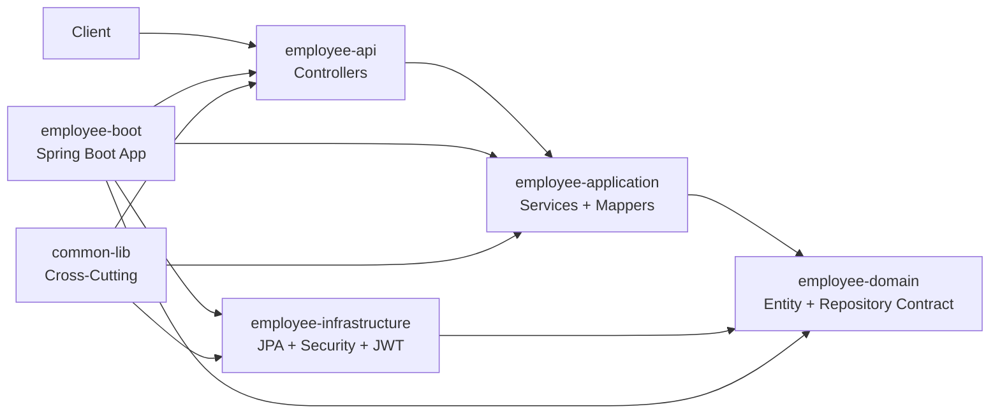

# SpringBoot Enterprise Application

## Project Overview
Enterprise-grade multi-module Maven solution implementing an **Employee Management System REST API** with clean architecture boundaries, production concerns (security, logging, validation, observability), and deployment readiness.

## Requirements Gathering
### Functional Requirements
- Create employee
- Update employee
- Get employee by ID
- Search employees by department/name
- Pagination and sorting
- Soft delete

### Non-Functional Requirements
- Security: Basic authentication + JWT
- Logging: structured logs with correlation ID
- Validation: bean validation for request payloads
- Scalability: modular architecture, stateless API, pageable endpoints
- Error Handling: centralized exception strategy

## Architecture
### Clean Architecture Dependency Flow
- `employee-api -> employee-application -> employee-domain`
- `employee-infrastructure -> employee-domain`
- `employee-boot -> all modules`
- `common-lib` shared cross-cutting concerns

### Module Explanation
- `common-lib`: shared exceptions, handlers, response models, constants, correlation logging filter, token service contract.
- `employee-domain`: core entity, enums, repository abstraction.
- `employee-application`: DTOs, mapper, service contracts and business logic.
- `employee-infrastructure`: JPA repository implementation, JWT service, security configuration.
- `employee-api`: REST controllers, auth endpoint, OpenAPI configuration.
- `employee-boot`: executable Spring Boot module and runtime configuration.

## LLD (Mermaid)


## API Documentation
### Endpoints
- `POST /employees`
- `GET /employees/{id}`
- `GET /employees?department=IT&name=john&page=0&size=10&sort=firstName,asc`
- `PUT /employees/{id}`
- `DELETE /employees/{id}` (soft delete)
- `POST /auth/login`

### Standard Success Response
```json
{
  "timestamp": "2026-01-01T10:00:00Z",
  "status": 200,
  "message": "Request processed successfully",
  "data": {}
}
```

### Error Response
```json
{
  "timestamp": "2026-01-01T10:00:00Z",
  "status": 400,
  "message": "Validation failed",
  "path": "/employees",
  "errors": ["First name is required"]
}
```

## Security
- HTTP Basic authentication enabled.
- In-memory users:
  - `admin/admin123` (roles: ADMIN, USER)
  - `user/user123` (role: USER)
- JWT login endpoint returns bearer token.
- Role-based access with method-level authorization.

## Validation
- `@NotBlank`, `@Email`, `@Positive`, `@NotNull` on request DTO.
- Global exception handler maps validation failures into structured error responses.

## Swagger / OpenAPI
- UI: `http://localhost:8080/swagger-ui/index.html`
- Docs: `http://localhost:8080/v3/api-docs`

## Running Instructions
### Prerequisites
- Java 17
- Maven 3.9+
- MySQL (local profile)

### Build
```bash
mvn clean package
```

### Run (default profile with MySQL)
```bash
mvn -pl employee-management/employee-boot spring-boot:run
```

### Run Tests
```bash
mvn test
```

## Docker Deployment
> `docker-compose.yml` uses **MySQL** for containerized production-like runtime.

```bash
docker compose up --build
```

## Project Folder Structure
```text
springboot-application/
├── common-lib/
├── employee-management/
│   ├── employee-domain/
│   ├── employee-application/
│   ├── employee-infrastructure/
│   ├── employee-api/
│   └── employee-boot/
├── Dockerfile
└── docker-compose.yml
```
